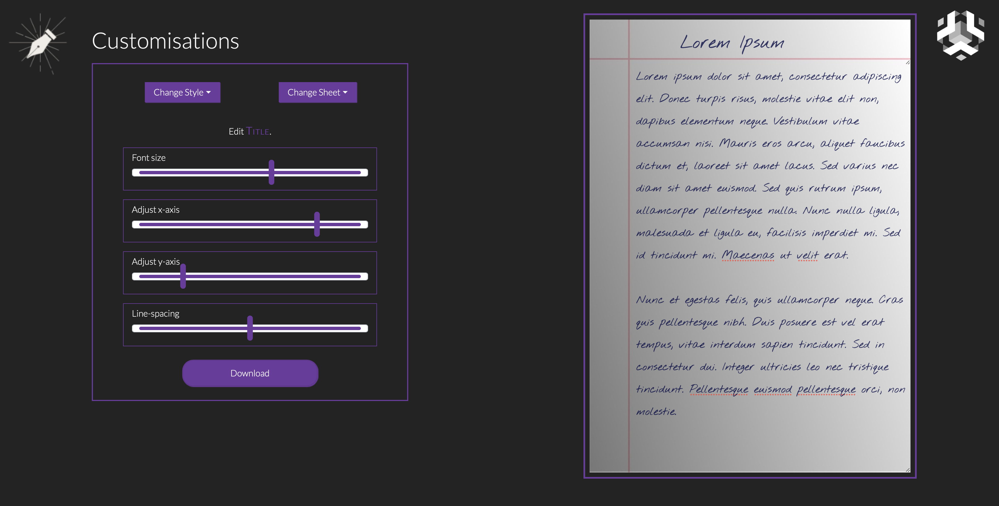

</a>
	<h2 align="center">DocGen</h2>
	<h4 align="center"> An easy to use one stop solution for generating handwritten documents without actually having to write one. Doc Writer is a savior for all those, who need to complete Handwritten work, without actually having to write one. Be it your assignments, home work or any other tasks, use it for all. <h4>
</p>

---

<!-- [](INSERT_LINK_FOR_DOCS_HERE)
[](INSERT_UI_LINK_HERE)

## Preview

 -->

## Functionalities
- [ ] Working
- [ ] Input text
- [ ] Change Font Style
- [ ] Change Sheet
- [x] Adjust Font size
- [x] Adjust x-axis and y-axis
- [x] Adjust Line spacing
- [ ] Download the File
- [ ] User Upload for Fonts
- [ ] User Upload for Sheets

<br>

## Instructions to run

- Pre-requisites: - Node.js > V8.x and npm 5.2+ is a minimum requirement.

```bash
# install dependencies
npm install

# serve with hot reload at localhost:8080
npm run dev

# build for production with minification
npm run build

# test the production build locally
npm run serve

# run tests with jest and preact-render-spy
npm run test
```


